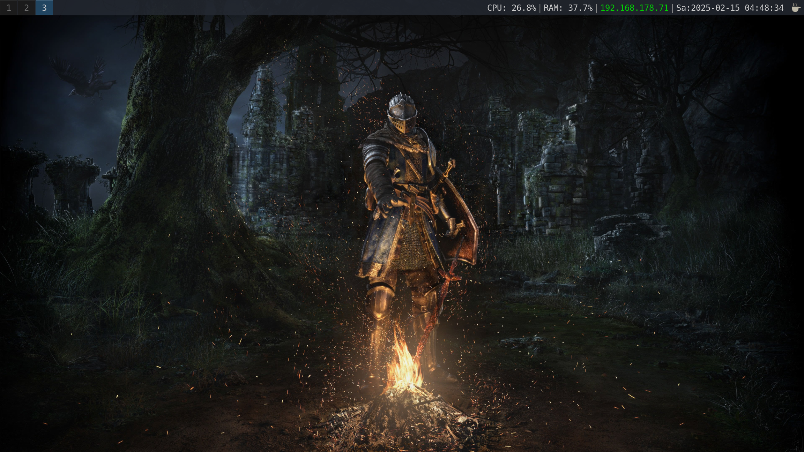
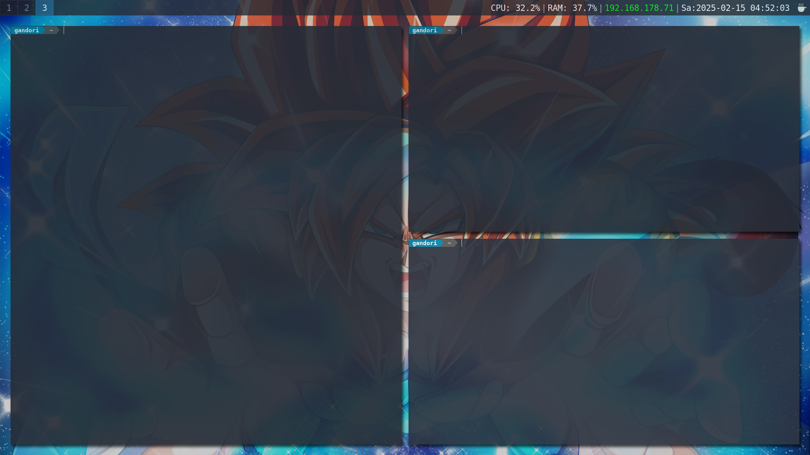
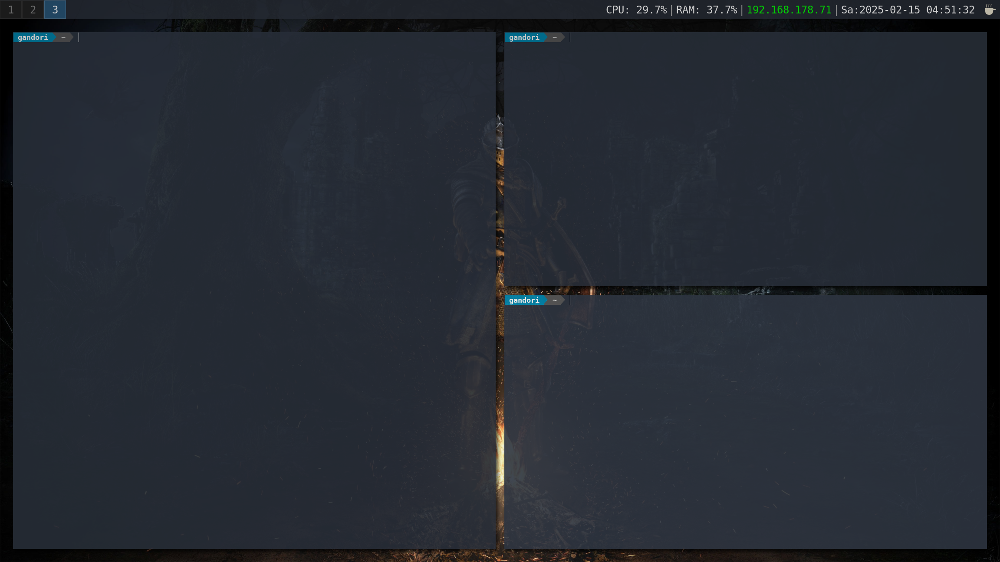
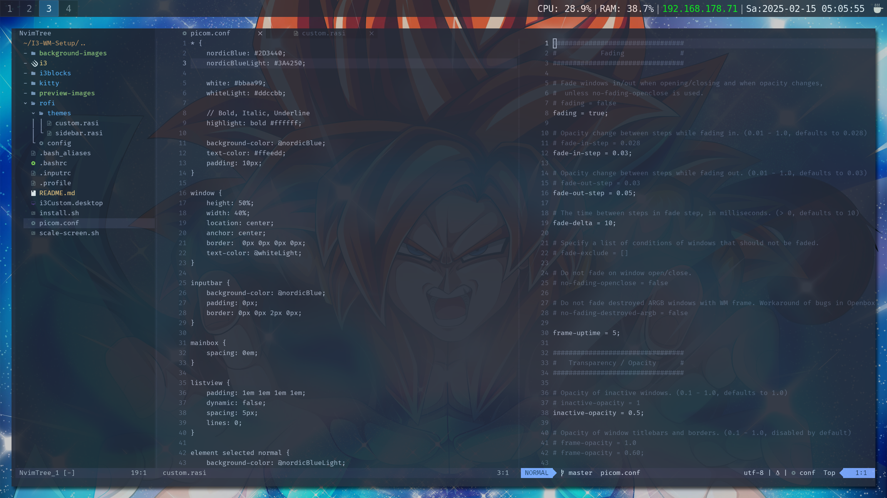
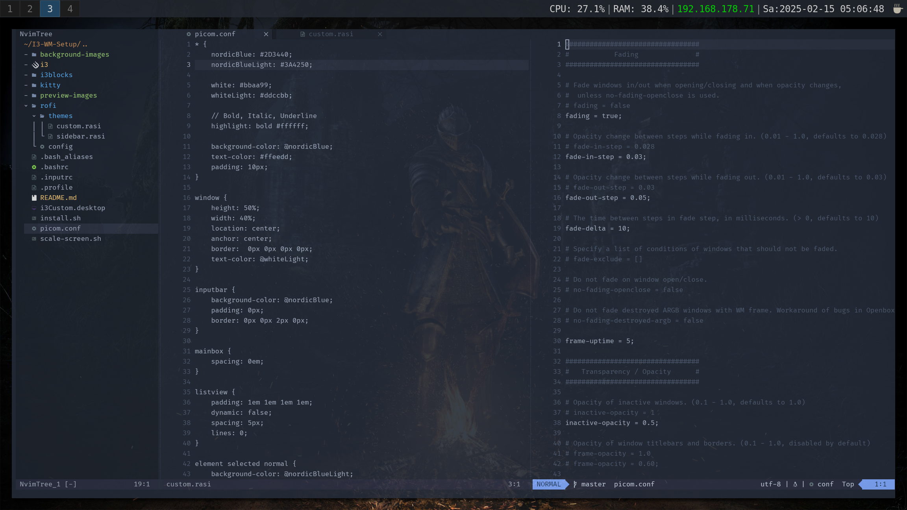

<h1 align='center'> I3 Window Manager Setup</h1>

<p align='center'>
    This repository contains my i3 configuration, which works flawlessly on my system.
</p>
<p align='center'>
If you want to use it, keep in mind that some adjustments may be necessary to make it work on your setup
</p>

***

<h2 align='center'><b>Information</b></h2>

<p align='center'><b>OS: </b>Ubuntu 20.04.6 LTS x86_64</p>
<p align='center'><b>Kernel: </b>5.4.0-200-generic</p>
<p align='center'><b>Package Manager: </b>apt</p>
<p align='center'><b>WM: </b>i3</p>
<p align='center'><b>Status Bar: </b>i3blocks</p>
<p align='center'><b>Launcher: </b>Rofi</p>
<p align='center'><b>Compositor: </b>Picom</p>
<p align='center'><b>Shell: </b>bash 5.0.17<p>
<p align='center'><b>Terminal: </b>gnome-terminal</p>
<p align='center'><b>Prompt Statusline: </b>Powerline</p>
<p align='center'><b>Main Code Editor: </b>Neovim</p>
<p align='center'><b>Secondary Code Editor: </b>Visual Studio Code</p>
<p align='center'><b>File Manager: </b>Thunar</p>
<p align='center'><b>Main Browser: </b>Firefox</p>
<p align='center'><b>Secondary Browser: </b>Brave & Chrome</p>
<p align='center'><b>Music Player: </b>musikcube</p>
<p align='center'><b>Image Editing: </b>Gimp & Krita</p>
<p align='center'><b>Video Editing: </b>Kdenlive</p>
<p align='center'><b>Audio Editing: </b>Audacity</p>
<p align='center'><b>Containerization: </b>Docker + Docker Compose & microk8s</p>
<p align='center'><b>Prevent Screen Locking: </b>Caffeine</p>

***

<h2 align='center'><b>Preview Images</b></h2>

<h5 align='center'><b>Desktop</b></h5>



<h5 align='center'><b>Gnome-Terminal</b></h5>



<h5 align='center'><b>Neovide+Neovim</b></h5>



### Install i3

**i3 Repo**
> https://github.com/i3/i3

**Get i3**
> https://i3wm.org/docs/repositories.html

***

### Setup Gnome-Terminal

**Load config**

```sh
cd gnome-terminal
```

```sh
. load.sh
```

***

### Install Neovim-0-10-4

**Neovim Repo**
> https://github.com/neovim/neovim

**Get Neovim-0-10-4**
```sh
wget -O nvim-0-10-4.AppImage https://github.com/neovim/neovim/releases/download/v0.10.4/nvim-linux-x86_64.appimage
```
**Moving the file to the correct location**
```sh
sudo cp ./nvim-0-10-4.AppImage /usr/local/bin/nvim
```

**Make the file executable**
```sh
sudo chmod +x /usr/local/bin/nvim
```

**Set the permissions**
```sh
sudo chmod 755 /usr/local/bin/nvim
```

***

### Install Neovide-0-14-0

**Neovide Repo**
> https://github.com/neovide/neovide

**Get Neovide-0-14-0**
```sh
wget -O neovide-0-14-0.AppImage  https://github.com/neovide/neovide/releases/download/0.14.0/neovide.AppImage
```

**Moving the file to the correct location**
```sh
sudo cp ./neovide-0-14-0.AppImage /usr/local/bin/neovide
```

**Make the file executable**
```sh
sudo chmod +x /usr/local/bin/neovide
```

**Set the permissions**
```sh
sudo chmod 755 /usr/local/bin/neovide
```

***

### Install Audacity-3-7-1

**Audacity Repo**
> https://github.com/audacity/audacity

**Get Audacity-3-7-1**
```sh
wget -O audacity-3-7-1.AppImage https://github.com/audacity/audacity/releases/download/Audacity-3.7.1/audacity-linux-3.7.1-x64-22.04.AppImage
```

**Moving the file to the correct location**
```sh
sudo cp ./audacity-3-7-1.AppImage /usr/local/bin/audacity
```

**Make the file executable**
```sh
sudo chmod +x /usr/local/bin/audacity
```

**Set the permissions**
```sh
sudo chmod 755 /usr/local/bin/audacity
```

***

### Install Krita-5-2-9

**Krita Repo**
> https://github.com/KDE/krita

**Get Krita**
```sh
wget -O krita.AppImage https://download.kde.org/stable/krita/5.2.9/krita-5.2.9-x86_64.AppImage
```

**Moving the file to the correct location**
```sh
sudo cp ./krita.AppImage /usr/local/bin/krita
```

**Make the file executable**
```sh
sudo chmod +x /usr/local/bin/krita
```

**Set the permissions**
```sh
sudo chmod 755 /usr/local/bin/krita
```

***

### Install Polybar

**Polybar Repo**
> https://github.com/polybar/polybar

**Get Polybar**
> Testing with Ubuntu 19.04
```sh
sudo add-apt-repository ppa:kgilmer/speed-ricer
```
```sh
sudo apt update
```
```sh
sudo apt install polybar
```

