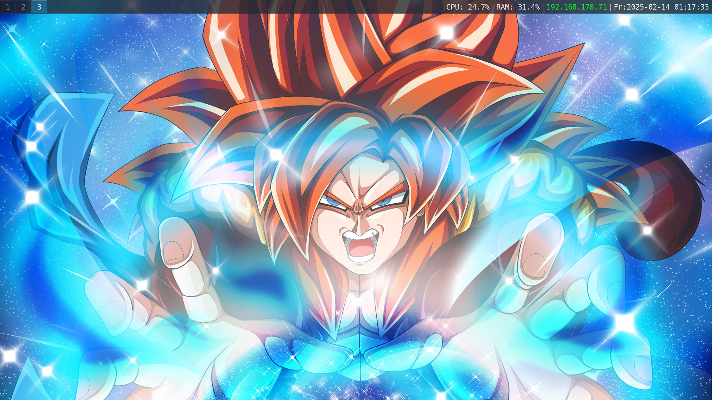
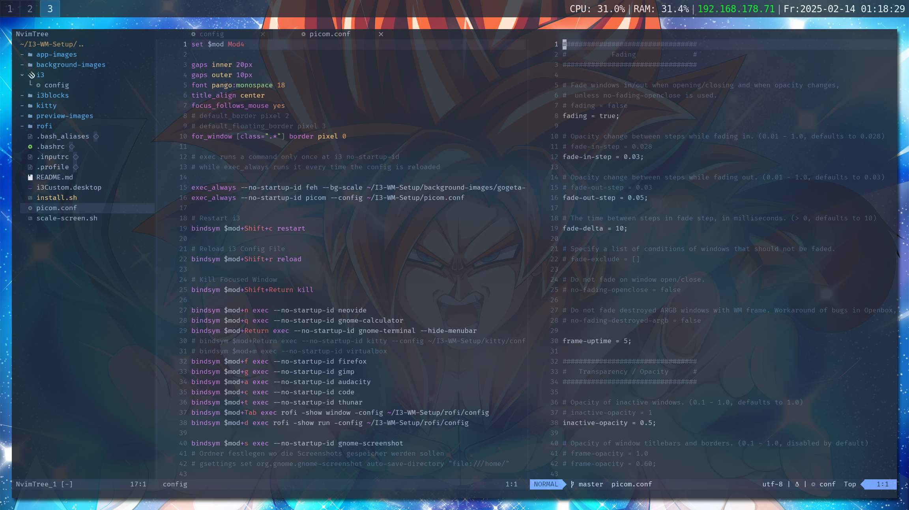
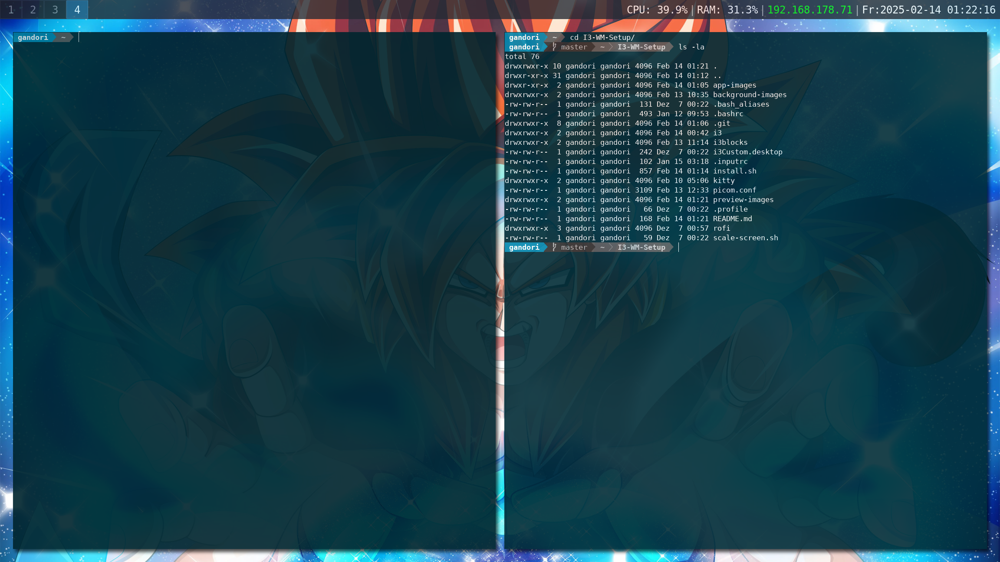

# I3 Window Manager Setup

### Preview Images





### Install Neovide-0.14-0

**Neovide Repo**
> https://github.com/neovide/neovide

**Get Neovide-0-14-0**
```sh
wget -o neovide-0-14-0.AppImage  https://github.com/neovide/neovide/releases/download/0.14.0/neovide.AppImage
```

**Moving the file to the correct location**
```sh
sudo cp ./neovide-0-14-0.AppImage /usr/local/bin/neovide
```

**Make the file executable**
```sh
sudo chmod +x /usr/local/bin/neovide
```

**Set the permissions**
```sh
sudo chmod 755 /usr/local/bin/neovide
```

### Install Audacity-3-7-1

**Audacity Repo**
> https://github.com/audacity/audacity

**Get Audacity-3-7-1**
```sh
wget -o audacity-3-7-1.AppImage https://github.com/audacity/audacity/releases/tag/Audacity-3.7.1
```

**Moving the file to the correct location**
```sh
sudo cp ./audacity-3-7-1.AppImage /usr/local/bin/audacity
```

**Make the file executable**
```sh
sudo chmod +x /usr/local/bin/audacity
```

**Set the permissions**
```sh
sudo chmod 755 /usr/local/bin/audacity
```

### Install Krita-0-0-0

**Krita Repo**
> https://github.com/KDE/krita

**Get Krita**
```sh
wget -o krita.AppImage https://download.kde.org/stable/krita/5.2.9/krita-5.2.9-x86_64.AppImage
```

**Moving the file to the correct location**
```sh
sudo cp ./krita.AppImage /usr/local/bin/krita
```

**Make the file executable**
```sh
sudo chmod +x /usr/local/bin/krita
```

**Set the permissions**
```sh
sudo chmod 755 /usr/local/bin/krita
```
